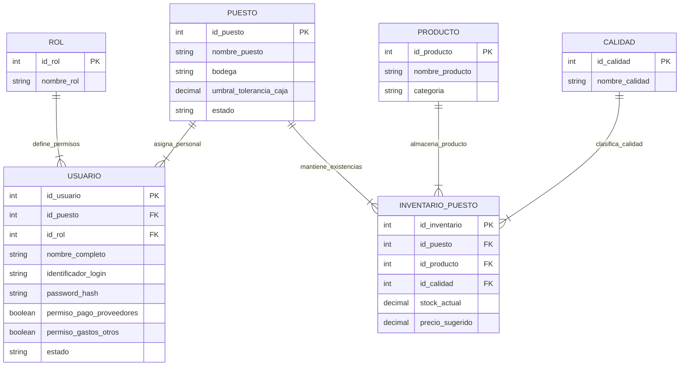

```mermaid
erDiagram
    %% --- IZQUIERDA: SEGURIDAD Y ACCESO ---
    ROL ||--|{ USUARIO : "define_permisos"
    PUESTO ||--|{ USUARIO : "asigna_personal"

    %% --- DERECHA: INVENTARIO Y CATÁLOGOS ---
    PUESTO ||--|{ INVENTARIO_PUESTO : "mantiene_existencias"
    PRODUCTO ||--|{ INVENTARIO_PUESTO : "almacena_producto"
    CALIDAD ||--|{ INVENTARIO_PUESTO : "clasifica_calidad"

    %% --- ENTIDADES Y ATRIBUTOS ---
    PUESTO {
        int id_puesto PK
        string nombre_puesto
        string bodega
        decimal umbral_tolerancia_caja
        string estado
    }

    ROL {
        int id_rol PK
        string nombre_rol
    }

    USUARIO {
        int id_usuario PK
        int id_puesto FK
        int id_rol FK
        string nombre_completo
        string identificador_login
        string password_hash
        boolean permiso_pago_proveedores
        boolean permiso_gastos_otros
        string estado
    }

    PRODUCTO {
        int id_producto PK
        string nombre_producto
        string categoria
    }

    CALIDAD {
        int id_calidad PK
        string nombre_calidad
    }

    INVENTARIO_PUESTO {
        int id_inventario PK
        int id_puesto FK
        int id_producto FK
        int id_calidad FK
        decimal stock_actual
        decimal precio_sugerido
    }
```
