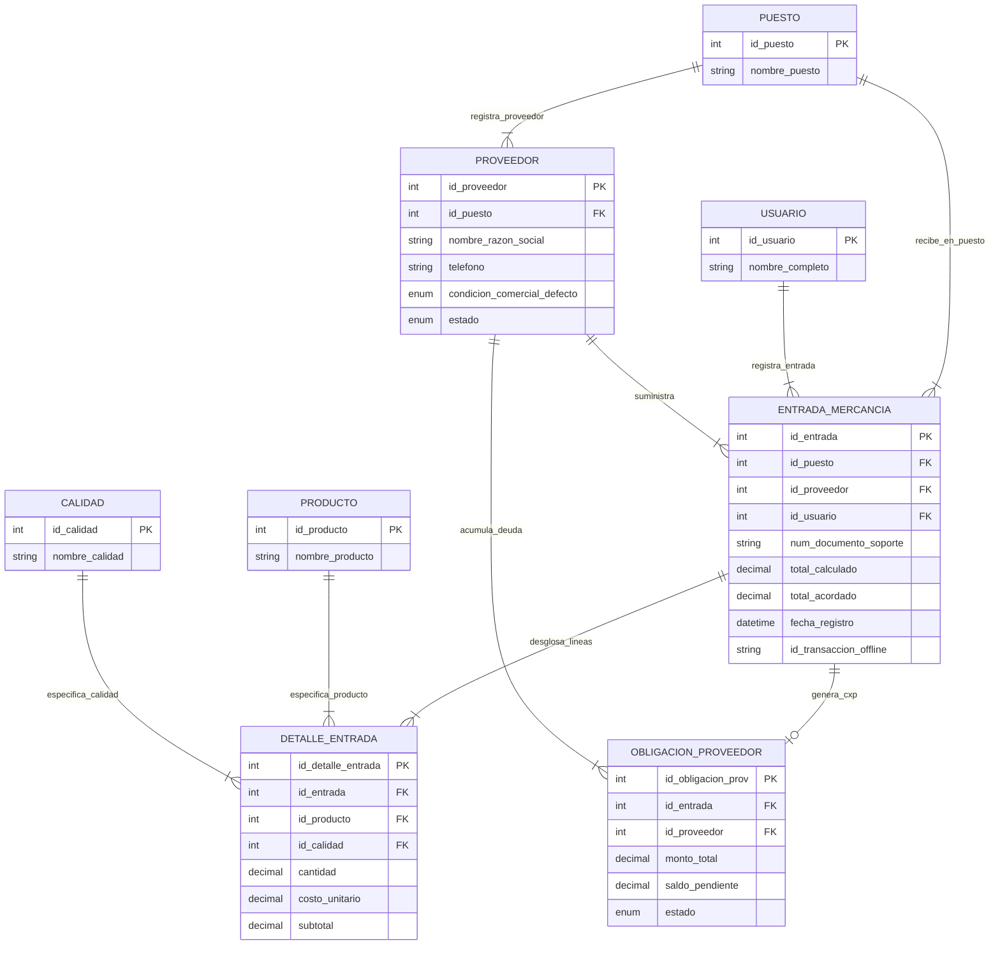

```mermaid
erDiagram
    %% --- CONEXIÓN CON NÚCLEO TRANSVERSAL ---
    PUESTO ||--|{ PROVEEDOR : "registra_proveedor"
    PUESTO ||--|{ ENTRADA_MERCANCIA : "recibe_en_puesto"
    USUARIO ||--|{ ENTRADA_MERCANCIA : "registra_entrada"
    PROVEEDOR ||--|{ ENTRADA_MERCANCIA : "suministra"

    %% --- ESTRUCTURA DE COMPRA Y CXP ---
    ENTRADA_MERCANCIA ||--|{ DETALLE_ENTRADA : "desglosa_lineas"
    PRODUCTO ||--|{ DETALLE_ENTRADA : "especifica_producto"
    CALIDAD ||--|{ DETALLE_ENTRADA : "especifica_calidad"
    ENTRADA_MERCANCIA ||--o| OBLIGACION_PROVEEDOR : "genera_cxp"
    PROVEEDOR ||--|{ OBLIGACION_PROVEEDOR : "acumula_deuda"

    %% --- ENTIDADES Y ATRIBUTOS ---
    PUESTO {
        int id_puesto PK
        string nombre_puesto
    }

    USUARIO {
        int id_usuario PK
        string nombre_completo
    }

    PROVEEDOR {
        int id_proveedor PK
        int id_puesto FK
        string nombre_razon_social
        string telefono
        enum condicion_comercial_defecto
        enum estado
    }

    ENTRADA_MERCANCIA {
        int id_entrada PK
        int id_puesto FK
        int id_proveedor FK
        int id_usuario FK
        string num_documento_soporte
        decimal total_calculado
        decimal total_acordado
        datetime fecha_registro
        string id_transaccion_offline
    }

    DETALLE_ENTRADA {
        int id_detalle_entrada PK
        int id_entrada FK
        int id_producto FK
        int id_calidad FK
        decimal cantidad
        decimal costo_unitario
        decimal subtotal
    }

    OBLIGACION_PROVEEDOR {
        int id_obligacion_prov PK
        int id_entrada FK
        int id_proveedor FK
        decimal monto_total
        decimal saldo_pendiente
        enum estado
    }

    PRODUCTO {
        int id_producto PK
        string nombre_producto
    }

    CALIDAD {
        int id_calidad PK
        string nombre_calidad
    }
```