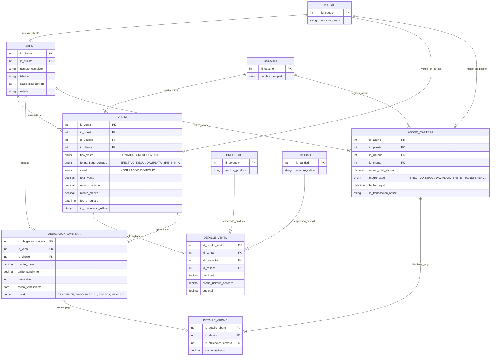

```mermaid
erDiagram
    %% --- RELACIONES MÓDULO 2 ---
    PUESTO ||--|{ CLIENTE : "registra_cliente"
    PUESTO ||--|{ VENTA : "vende_en_puesto"
    PUESTO ||--|{ ABONO_CARTERA : "recibe_en_puesto"

    USUARIO ||--|{ VENTA : "registra_venta"
    USUARIO ||--|{ ABONO_CARTERA : "registra_abono"

    CLIENTE ||--o{ VENTA : "asociado_a"
    CLIENTE ||--|{ OBLIGACION_CARTERA : "adeuda"
    CLIENTE ||--|{ ABONO_CARTERA : "realiza_abono"

    VENTA ||--|{ DETALLE_VENTA : "desglosa_lineas"
    VENTA ||--o| OBLIGACION_CARTERA : "genera_cxc"

    PRODUCTO ||--|{ DETALLE_VENTA : "especifica_producto"
    CALIDAD ||--|{ DETALLE_VENTA : "especifica_calidad"

    ABONO_CARTERA ||--|{ DETALLE_ABONO : "distribuye_pago"
    OBLIGACION_CARTERA ||--|{ DETALLE_ABONO : "recibe_pago"

    %% --- ENTIDADES Y ATRIBUTOS ---
    PUESTO {
        int id_puesto PK
        string nombre_puesto
    }

    USUARIO {
        int id_usuario PK
        string nombre_completo
    }

    CLIENTE {
        int id_cliente PK
        int id_puesto FK
        string nombre_completo
        string telefono
        int plazo_dias_defecto
        string estado
    }

    VENTA {
        int id_venta PK
        int id_puesto FK
        int id_usuario FK
        int id_cliente FK
        enum tipo_venta "CONTADO, CREDITO, MIXTA"
        enum forma_pago_contado "EFECTIVO, NEQUI, DAVIPLATA, BRE_B, N_A"
        enum canal "MOSTRADOR, DOMICILIO"
        decimal total_venta
        decimal monto_contado
        decimal monto_credito
        datetime fecha_registro
        string id_transaccion_offline
    }

    DETALLE_VENTA {
        int id_detalle_venta PK
        int id_venta FK
        int id_producto FK
        int id_calidad FK
        decimal cantidad
        decimal precio_unitario_aplicado
        decimal subtotal
    }

    OBLIGACION_CARTERA {
        int id_obligacion_cartera PK
        int id_venta FK
        int id_cliente FK
        decimal monto_inicial
        decimal saldo_pendiente
        int plazo_dias
        date fecha_vencimiento
        enum estado "PENDIENTE, PAGO_PARCIAL, PAGADA, VENCIDA"
    }

    ABONO_CARTERA {
        int id_abono PK
        int id_puesto FK
        int id_usuario FK
        int id_cliente FK
        decimal monto_total_abono
        enum medio_pago "EFECTIVO, NEQUI, DAVIPLATA, BRE_B, TRANSFERENCIA"
        datetime fecha_registro
        string id_transaccion_offline
    }

    DETALLE_ABONO {
        int id_detalle_abono PK
        int id_abono FK
        int id_obligacion_cartera FK
        decimal monto_aplicado
    }

    PRODUCTO {
        int id_producto PK
        string nombre_producto
    }

    CALIDAD {
        int id_calidad PK
        string nombre_calidad
    }
```