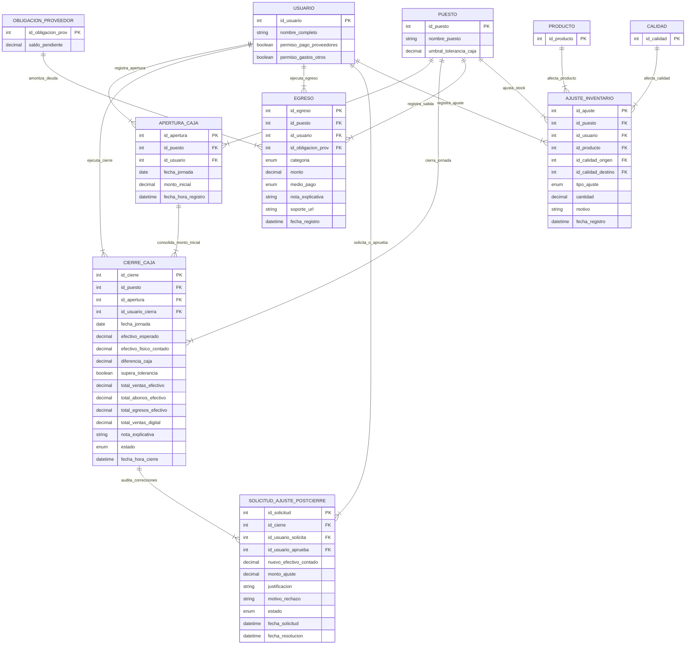

```mermaid
erDiagram
    %% --- RELACIONES MÓDULO 3 ---
    PUESTO ||--|{ APERTURA_CAJA : "abre_jornada"
    PUESTO ||--|{ CIERRE_CAJA : "cierra_jornada"
    PUESTO ||--|{ EGRESO : "registra_salida"
    PUESTO ||--|{ AJUSTE_INVENTARIO : "ajusta_stock"

    USUARIO ||--|{ APERTURA_CAJA : "registra_apertura"
    USUARIO ||--|{ CIERRE_CAJA : "ejecuta_cierre"
    USUARIO ||--|{ EGRESO : "ejecuta_egreso"
    USUARIO ||--|{ SOLICITUD_AJUSTE_POSTCIERRE : "solicita_o_aprueba"
    USUARIO ||--|{ AJUSTE_INVENTARIO : "registra_ajuste"

    APERTURA_CAJA ||--|{ CIERRE_CAJA : "consolida_monto_inicial"
    CIERRE_CAJA ||--|{ SOLICITUD_AJUSTE_POSTCIERRE : "audita_correcciones"
    OBLIGACION_PROVEEDOR ||--|{ EGRESO : "amortiza_deuda"

    PRODUCTO ||--|{ AJUSTE_INVENTARIO : "afecta_producto"
    CALIDAD ||--|{ AJUSTE_INVENTARIO : "afecta_calidad"

    %% --- ENTIDADES Y ATRIBUTOS ---
    PUESTO {
        int id_puesto PK
        string nombre_puesto
        decimal umbral_tolerancia_caja
    }

    USUARIO {
        int id_usuario PK
        string nombre_completo
        boolean permiso_pago_proveedores
        boolean permiso_gastos_otros
    }

    APERTURA_CAJA {
        int id_apertura PK
        int id_puesto FK
        int id_usuario FK
        date fecha_jornada
        decimal monto_inicial
        datetime fecha_hora_registro
    }

    EGRESO {
        int id_egreso PK
        int id_puesto FK
        int id_usuario FK
        int id_obligacion_prov FK
        enum categoria
        decimal monto
        enum medio_pago
        string nota_explicativa
        string soporte_url
        datetime fecha_registro
    }

    CIERRE_CAJA {
        int id_cierre PK
        int id_puesto FK
        int id_apertura FK
        int id_usuario_cierra FK
        date fecha_jornada
        decimal efectivo_esperado
        decimal efectivo_fisico_contado
        decimal diferencia_caja
        boolean supera_tolerancia
        decimal total_ventas_efectivo
        decimal total_abonos_efectivo
        decimal total_egresos_efectivo
        decimal total_ventas_digital
        string nota_explicativa
        enum estado
        datetime fecha_hora_cierre
    }

    SOLICITUD_AJUSTE_POSTCIERRE {
        int id_solicitud PK
        int id_cierre FK
        int id_usuario_solicita FK
        int id_usuario_aprueba FK
        decimal nuevo_efectivo_contado
        decimal monto_ajuste
        string justificacion
        string motivo_rechazo
        enum estado
        datetime fecha_solicitud
        datetime fecha_resolucion
    }

    AJUSTE_INVENTARIO {
        int id_ajuste PK
        int id_puesto FK
        int id_usuario FK
        int id_producto FK
        int id_calidad_origen FK
        int id_calidad_destino FK
        enum tipo_ajuste
        decimal cantidad
        string motivo
        datetime fecha_registro
    }

    OBLIGACION_PROVEEDOR {
        int id_obligacion_prov PK
        decimal saldo_pendiente
    }

    PRODUCTO {
        int id_producto PK
    }

    CALIDAD {
        int id_calidad PK
    }
```